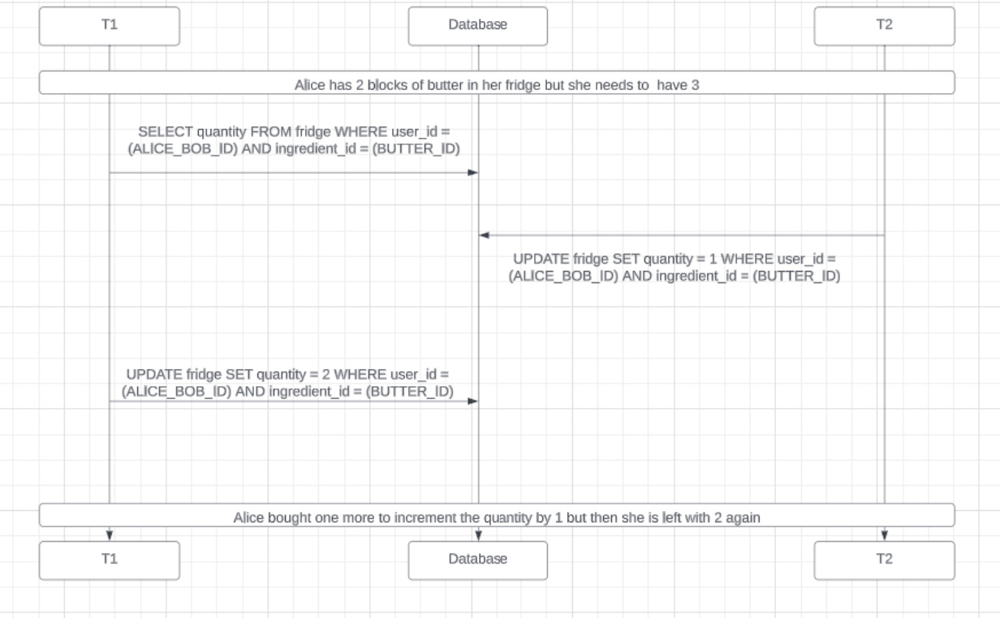
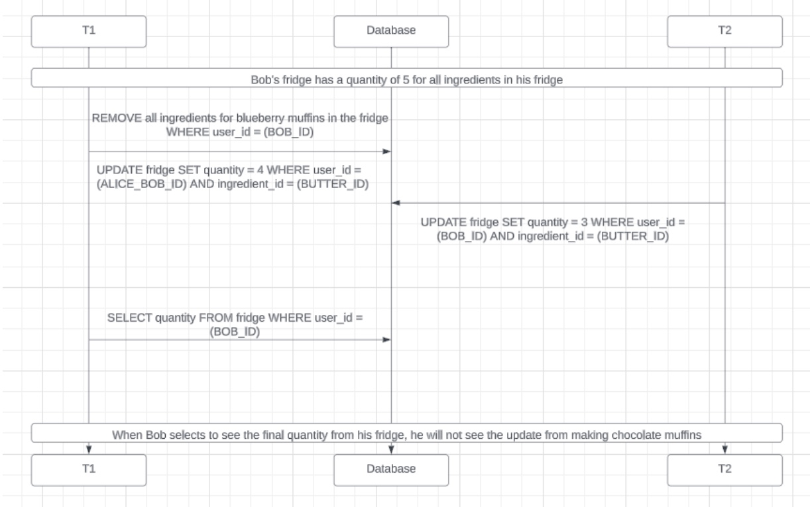

Case 1: Bob is looking to make Brussels sprouts, so he removes a list of ingredients from his fridge (fridge/remove_recipe_ingredients). He only has enough ingredients to make one batch of Brussels sprouts. At the same time, he is looking to make another recipe (recipe/get_recipe), and he returns Brussels sprouts as a possible recipe to be considered. This is a Lost Update Phenomenon because the update from the first transaction is not completed before the read of the second transaction.

Ensurance: We will use a two-phase locking protocol to ensure that the correct data is being updated and read. In this case, Bob’s first transaction will lock his second one until it is complete. Then, when it unlocks, the second transaction completes.
 

Case 2: Alice and Bob are planning to make food with a joint fridge that they share from living together. Alice wants to look into her shopping list and confirm how much butter she needs for garlic butter steak bites for her fridge. While the query is running, Bob is changing the amount of butter in the fridge to make shrimp-fried rice. Now, Alice is looking at the wrong amount of butter she needs and will not have enough butter to make the recipe. This is Read Skew as Bob’s update query interferes with Alice’s query and returns a result that is inconsistent with the users’ fridges.

Ensurance: When Alice starts her select query, we can assign her a temporary exclusive role, ensuring she is the only user with access to update queries. This prevents Bob from updating any values until Alice completes her query. Once Alice receives the query result, her exclusive role is then unassigned, allowing anyone else to access or update the database.

Case 3: Bob just made blueberry muffins, so he removes those ingredients from his fridge (/remove_ingredients). At the same time, he is looking to make chocolate muffins, and the two recipes have a lot of ingredient overlap. When he removes the needed ingredients for the recipe from his shopping list (/remove_ingredients), an incorrect value is given because Transaction 1 (T1) didn’t finish before Transaction 2 (T2).

Ensurance: We will use a two-phase locking protocol to ensure that the correct data is being updated and read. In this case, Bob’s first transaction will lock his second one until it is complete. Then, when it unlocks, the second transaction completes.

